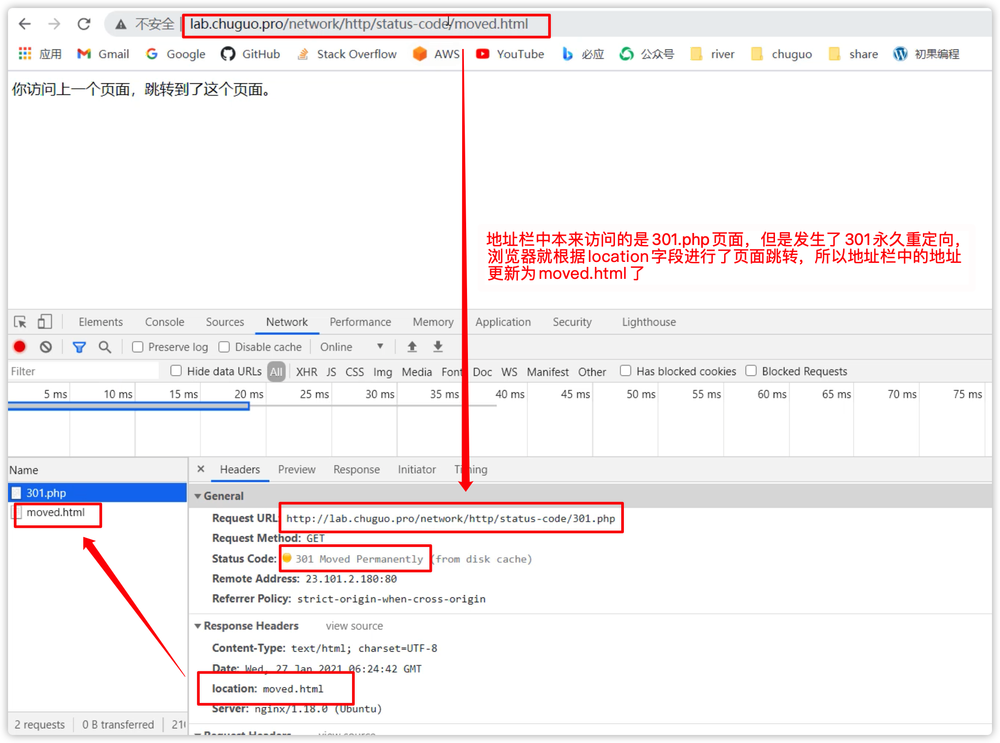
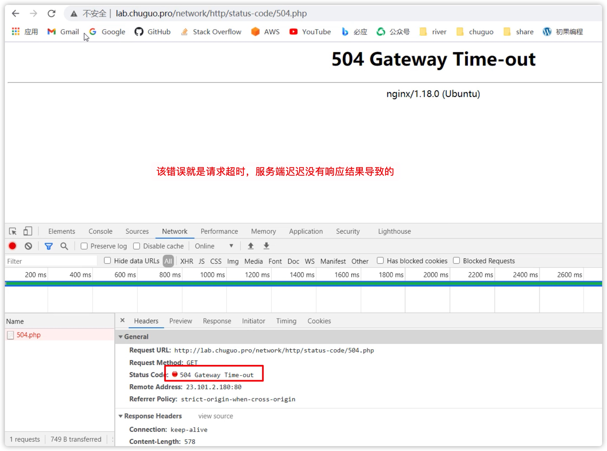

## 🇨🇳一、1xx
### <font color=cyan></font>
### <font color=cyan></font>
### <font color=cyan></font>

## 🇨🇳二、2xx
### <font color=cyan></font>
### <font color=cyan></font>
### <font color=cyan></font>

## 🇨🇳三、3xx
| 状态码 | 状态码英文名称 | 描述 |
| :- | :- | :- |
| 300 | Multiple Choices | 多种选择。请求的资源可包括多个位置，相应可返回一个资源特征与地址的列表用于用户终端（例如：浏览器）选择 |
| 301 | Moved Permanently | 永久移动。请求的资源已被永久的移动到新URI，返回信息会包括新的URI，浏览器会自动定向到新URI。今后任何新的请求都应使用新的URI代替 |
| 302 | Found | 临时移动。与301类似。但资源只是临时被移动。客户端应继续使用原有URI |
| 303 | See Other | 查看其它地址。与301类似。使用GET和POST请求查看 |
| 304 | Not Modified | 未修改。所请求的资源未修改，服务器返回此状态码时，不会返回任何资源。客户端通常会缓存访问过的资源，通过提供一个头信息指出客户端希望只返回在指定日期之后修改的资源 |
| 305 | Use Proxy | 使用代理。所请求的资源必须通过代理访问 |
| 306 | Unused | 已经被废弃的HTTP状态码 |
| 307 | Temporary Redirect | 临时重定向。与302类似。使用GET请求重定向 |

## 🇨🇳四、4xx
| 状态码 | 状态码英文名称 | 描述 |
| :- | :- | :- |
| 400 | Bad Request | 客户端请求的语法错误，服务器无法理解 |
| 401 | Unauthorized | 请求要求用户的身份认证 |
| 402 | Payment Required | 保留，将来使用 |
| 403 | Forbidden | 服务器理解请求客户端的请求，但是拒绝执行此请求 |
| 404 | Not Found | 服务器无法根据客户端的请求找到资源（网页）。通过此代码，网站设计人员可设置"您所请求的资源无法找到"的个性页面 |
| 405 | Method Not Allowed | 客户端请求中的方法被禁止 |


## 🇨🇳五、5xx
| 状态码 | 状态码英文名称 | 描述 |
| :- | :- | :- |
| 500 | Internal Server Error | 服务器内部错误，无法完成请求 |
| 501 | Not Implemented | 服务器不支持请求的功能，无法完成请求 |
| 502 | Bad Gateway | 作为网关或者代理工作的服务器尝试执行请求时，从远程服务器接收到了一个无效的响应 |
| 503 | Service Unavailable | 由于超载或系统维护，服务器暂时的无法处理客户端的请求。延时的长度可包含在服务器的Retry-After头信息中 |
| 504 | Gateway Time-out | 充当网关或代理的服务器，未及时从远端服务器获取请求 |
| 505 | HTTP Version not supported | 服务器不支持请求的HTTP协议的版本，无法完成处理 |

## <font color=cyan>301</font>
永久跳转 Moved Permanently  
如果一个资源发生了永久重定向，那么服务端会在响应中添加一个location响应头字段，告诉浏览器资源移动到了location指向的地址了。如果请求是在浏览器地址栏中输入的，比如一个get请求，那么浏览器还会根据location响应头字段，自动跳转到相应的地址。


## <font color=cyan>302</font>
临时跳转 Moved Temporary

## <font color=cyan>304</font>
缓存 

出现304的状态码，就表示发生了协商缓存。

## <font color=cyan>403</font>
权限不足 Forbidden  
比如服务端要读取服务器/data文件夹里的文件时，有的服务端的用户权限不够，就会返回一个403的错误。比如，服务器上有个用户叫xiaoming，xiaoming在自己的家目录下部署了一个app服务，该app服务的某个接口需要读取/data目录下的文件，如果root用户未对xiaoming同学开放/data目录的读取权限的话，此时，服务端就会返回一个状态码为`403 Forbidden`错误。

所以当发生403错误的时候，首先要看一下后端运行脚本的权限。如果没有权限的话，排查一下是哪个文件没有权限，比如是/data没有权限，可以执行`chmod o+rx /data`开放一下权限。

## <font color=cyan>404</font>
没有找到 Not Found  
这个错误经常遇到，就是前端请求的某个路径指向的接口或者资源，服务端找不到的话，就会返回状态码为`404 Not Found`的错误。
 
## <font color=cyan>500</font>
服务端内部错误 Internal Server Error  
该错误在开发阶段经常会遇到，服务端写的代码发生了错误，那么请求就会报错，返回状态码为`500 Internal Server Error`的错误。

500的错误信息，通常可以通过后台服务的错误捕获机制，将错误信息存储到log中，以便以开发人员可以排查出错的代码在什么地方。

## <font color=cyan>502</font>
服务端网管错误 Bad Gateway

作为网管或者代理工作的服务器尝试执行请求时，从上游服务器接收到无效的响应。比如nginx从CGI接收到了不完整的response数据。还比如服务端尝试连接mysql，但是长时间连接不上，就会返回502。

说白了，502错误就是指Web服务器和后台CGI通信问题。当请求到达托管代理层，比如是Nginx的时候，nginx会把请求转发给服务器端的某个服务，如果这个时候这两者之间的通信发生了问题，例如nginx未能成功将请求转发给后台服务程序，就会返回一个`502 Bad Gateway`的错误。

## <font color=cyan>503</font>
503 Service Unavailable

服务暂时不可用，一段时间后，服务就可以正常工作了。

在代码发布的时候，可能会使用到。比如go服务，在发版前需要将之前运行的进程kill掉，之后启动新的进程。但在这个过程间隙，会导致已连接的客户端处理中断。所以在发版前，会先返回503，等待已经接收的请求处理完成，然后发版升级。

## <font color=cyan>504</font>
服务端网关超时 Gateway Timeout

网关超时。为了完成一个http请求，改服务器访问一个上游服务器，但是没有得到及时的响应。

比如：nginx超过了自己设置的超时时间，不等待CGI的返回结果，就会直接给客户端返回504错误。但是此时，CGI依然还在差不离请求（在没有超出自己的超时时间的情况下）。

比如某个接口超时了，nginx迟迟得不到响应，超过了nginx设置的超时时间，就会报`504 Gateway Time-out`的错误。



这个504的超时时间，在nginx里的配置：
```shell
http {
    fastcgi_read_timeout 50s;
}
```
意思是，如果nginx向服务端发送的请求，如果超过了50s，还是没有得到服务端的响应，就返回504。


http的相关信息可以查看RFC2616上的说明。