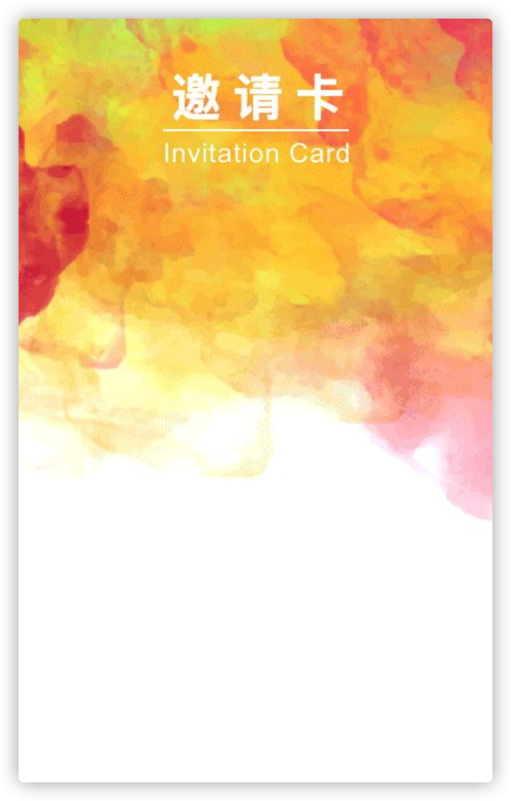

今天老板提了需求，要在服务端生成邀请卡，嗯…，简单的说就是把要这张：



变成差多这样的：


后端搞ruby的哥们搞了个html转图片，说转得太慢了，我就把这坑接下来了
所以睡前就倒腾了下，搞了个简单的实现

## 解决思路
文字转svg -> svg转png -> 合并图片

## 相关轮子
* images Node.js 轻量级跨平台图像编解码库，不需要额外安装依赖
* text-to-svg 文字转svg
* svg2png svg转png图片

## 示例代码
```js
'use strict';

const fs = require('fs');
const images = require('images');
const TextToSVG = require('text-to-svg');
const svg2png = require("svg2png");
const Promise = require('bluebird');

Promise.promisifyAll(fs);

const textToSVG = TextToSVG.loadSync('fonts/文泉驿微米黑.ttf');

const sourceImg = images('./i/webwxgetmsgimg.jpg');
const sWidth = sourceImg.width();
const sHeight = sourceImg.height();

const svg1 = textToSVG.getSVG('魏长青-人人讲App', {
  x: 0,
  y: 0,
  fontSize: 24,
  anchor: 'top',
});

const svg2 = textToSVG.getSVG('邀请您参加', {
  x: 0,
  y: 0,
  fontSize: 16,
  anchor: 'top',
});

const svg3 = textToSVG.getSVG('人人讲课程', {
  x: 0,
  y: 0,
  fontSize: 32,
  anchor: 'top',
});

Promise.coroutine(function* generateInvitationCard() {
  const targetImg1Path = './i/1.png';
  const targetImg2Path = './i/2.png';
  const targetImg3Path = './i/3.png';
  const targetImg4Path = './i/qrcode.jpg';
  const [buffer1, buffer2, buffer3] = yield Promise.all([
    svg2png(svg1),
    svg2png(svg2),
	svg2png(svg3),
  ]);

  yield Promise.all([
    fs.writeFileAsync(targetImg1Path, buffer1),
    fs.writeFileAsync(targetImg2Path, buffer2),
    fs.writeFileAsync(targetImg3Path, buffer3),
  ]);

  const target1Img = images(targetImg1Path);
  const t1Width = target1Img.width();
  const t1Height = target1Img.height();
  const offsetX1 = (sWidth - t1Width) / 2;
  const offsetY1 = 200;

  const target2Img = images(targetImg2Path);
  const t2Width = target2Img.width();
  const t2Height = target2Img.height();
  const offsetX2 = (sWidth - t2Width) / 2;
  const offsetY2 = 240;

  const target3Img = images(targetImg3Path);
  const t3Width = target3Img.width();
  const t3Height = target3Img.height();
  const offsetX3 = (sWidth - t3Width) / 2;
  const offsetY3 = 270;

  const target4Img = images(targetImg4Path);
  const t4Width = target4Img.width();
  const t4Height = target4Img.height();
  const offsetX4 = (sWidth - t4Width) / 2;
  const offsetY4 = 400;

  images(sourceImg)
  .draw(target1Img, offsetX1, offsetY1)
  .draw(target2Img, offsetX2, offsetY2)
  .draw(target3Img, offsetX3, offsetY3)
  .draw(target4Img, offsetX4, offsetY4)
  .save('./i/card.png', { quality : 90 });
})().catch(e => console.error(e));
```

## 注意事项
* text-to-svg需要中文字体的支持，不然中文会乱码

在我的破电脑上执行一次只花了500多毫秒，感觉足够了，分享出来希望能给大家一个参照

厚脸皮的问一下，能加个精不？😂

## 原文引用
[node文字转图片](https://cnodejs.org/topic/583c5d9fba57ffba06c24a89)