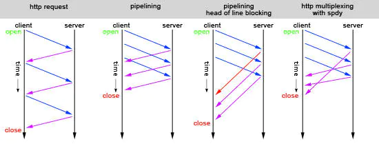

# http中的队头阻塞（Head of line blocking）多路复用（Multiplexing）

最近在网上常看到这些词汇：Head of line blocking、Multiplexing。今天借用一张图，稍微理解一下。

* 图中第一种请求方式，就是单次发送request请求，收到response后再进行下一次请求，显示是很低效的。
* 于是http1.1提出了管线化(pipelining)技术，就是如图中第二中请求方式，一次性发送多个request请求。
* 然而pipelining在接收response返回时，也必须依顺序接收，如果前一个请求遇到了阻塞，后面的请求即使已经处理完毕了，仍然需要等待阻塞的请求处理完毕。这种情况就如图中第三种，第一个请求阻塞后，后面的请求都需要等待，这也就是队头阻塞(Head of line blocking)。
* 为了解决上述阻塞问题，http2中提出了多路复用(Multiplexing)技术，Multiplexing是通信和计算机网络领域的专业名词。http2中将多个请求复用同一个tcp链接中，将一个TCP连接分为若干个流（Stream），每个流中可以传输若干消息（Message），每个消息由若干最小的二进制帧（Frame）组成。也就是将每个request-response拆分为了细小的二进制帧Frame，这样即使一个请求被阻塞了，也不会影响其他请求，如图中第四种情况所示。
## QUIC
* 上面说的情况都是基于TCP，因为TCP是可靠的传输协议，如果一个TCP连接中的多个请求有一个请求丢包了，那么就会进行重传。而谷歌提出的QUIC(Quick UDP Internet Connections)，则是基于UDP+Http2的一个实验性的快速传输协议，UDP是面向数据报文的，所以遇到丢包的情况也不会进行重传，从而进一步减少网络延迟、解决队头阻塞问题。
