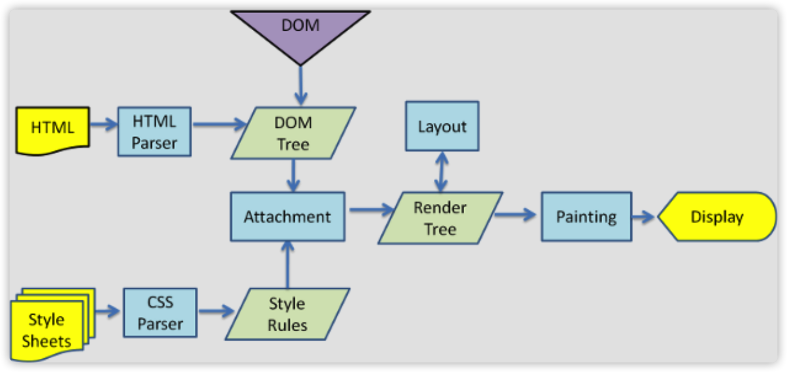
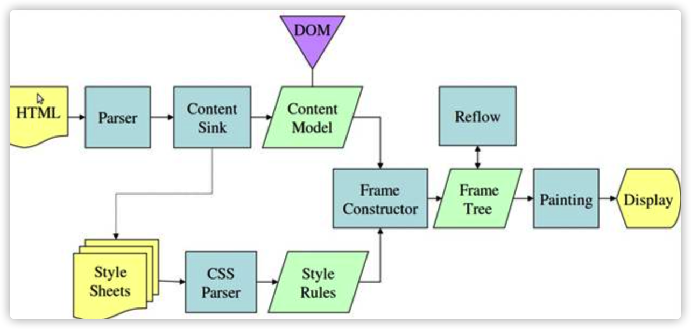
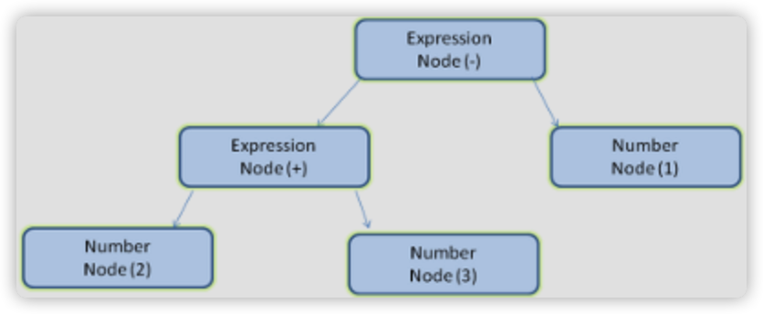

# [How browsers work](http://taligarsiel.com/Projects/howbrowserswork1.htm)

## 一、介绍
---
### 1. 涉及到的浏览器(The browsers we will talk about)
### 2. 浏览器的主要功能(The browser's main functionality)
### 3. 浏览器的顶层结构(The browser's high level structure)
The browser's main components are (1.1):

1. `The user interface` - this includes the address bar, back/forward button, bookmarking menu etc. Every part of the browser display except the main window where you see the requested page.
2. `The browser engine` - the interface for querying and manipulating the rendering engine.
3. `The rendering engine` - responsible for displaying the requested content. For example if the requested content is HTML, it is responsible for parsing the HTML and CSS and displaying the parsed content on the screen.
4. `Networking` - used for network calls, like HTTP requests. It has platform independent interface and underneath implementations for each platform.
5. `UI backend` - used for drawing basic widgets like combo boxes and windows. It exposes a generic interface that is not platform specific. Underneath it uses the operating system user interface methods.
6. `JavaScript interpreter`. Used to parse and execute the JavaScript code.
7. `Data storage`. This is a persistence layer. The browser needs to save all sorts of data on the hard disk, for examples, cookies. The new HTML specification (HTML5) defines 'web database' which is a complete (although light) database in the browser.

  
图片 1：浏览器的主要组件

### 4.组件间的通信(Communication between the components)

## 二、渲染引擎
---

渲染引擎的主要职责是渲染，负责在浏览器窗口上显示请求的内容。

渲染引擎默认可以显示HTML、XML文档和图片。它可以通过插件(浏览器扩展)显示其他类型。一个示例是使用PDF查看器插件显示PDF。我们将在一个特别的章节中讨论插件和扩展。在本章中，我们将关注主要的用例——显示使用CSS格式化的HTML和图像。

### 1. 渲染引擎(Rendering engines)

我们的参考浏览器- Firefox, Chrome和Safari是建立在两个渲染引擎之上的。Firefox使用Gecko——一个“自制”的Mozilla渲染引擎。Safari和Chrome都使用Webkit。

Webkit是一个开源的渲染引擎，最初是一个Linux平台的引擎，后来被苹果修改为支持Mac和Windows。参见[http://webkit.org/](http://webkit.org/)了解更多细节。

### 2. 主要流程(The main flow)

渲染引擎的工作是从网络层获取所请求文档的内容开始的。

下面是渲染引擎工作的基本流程:

  
图片 2：渲染引擎的基本流程

渲染引擎首先会解析HTML文档，并将标签转换为名为`内容树（DOM树）`的树中的DOM节点。它将解析外部CSS文件和样式元素（）中的样式数据。解析后的样式信息和HTML中的可视指令将用于创建另一个树——`渲染树（Render tree）`。

渲染树包含带有像颜色和尺寸等一类视觉属性的矩形。这些矩形将会以正确的顺序在屏幕上显示。

在构建了渲染树之后，它将经历一个`布局（layout）`过程。这意味着为每个节点提供它应该出现在屏幕上的确切坐标。下一阶段是`绘制（Painting）`—将遍历渲染树，并使用UI后端层绘制每个节点。

`重要的是要明白这是一个渐进的过程。为了获得更好的用户体验，渲染引擎将尝试尽快在屏幕上显示内容。它不会等到所有的HTML都被解析后才开始构建和布局渲染树。部分内容将被解析并显示，同时继续处理来自网络的其余内容。`

### 3. 主要流程示例(Main flow examples)

  
图片 3：webkit主要渲染流程

图片 4：Mozilla' Gecko主要渲染流程

从图3和图4可以看出，尽管Webkit和Gecko使用的术语略有不同，但流程基本上是相同的。

Gecko调用可视化格式化元素的树——`框架树（Frame tree）`。每个元素都是一个框架。Webkit使用术语“`渲染树（Render tree）`”，它由“`渲染对象（Render Objects）`”组成。Webkit使用术语“`布局（layout）`”来表示元素的放置，而Gecko称之为“`回流（Reflow）`”。“`附和（Attachment）`”是Webkit的术语，用于连接DOM节点和视觉信息（visual information 没猜错的话，此处就是document.styleSheets）来创建渲染树。一个很小的非语义差异是Gecko在HTML和DOM树之间有一个额外的层。它被称为“`内容接收器（content sink）`”，是制作DOM元素的工厂。我们将讨论流程的各个部分:

### 4. 解析和DOM树结构(Parsing and DOM tree construction)

#### 4.1. 解析（Parsing - genera）  

因为解析在渲染引擎里是一个非常重要的过程，我们将对此进行更深入的探讨。让我们从对解析的简单介绍开始。

解析文档意味着将其转换成有意义的结构——代码可以理解和使用的结构。解析的结果通常是表示文档结构的节点树。它被称为`解析树`或`语法树`。

解析表达式“2 + 3 - 1”会返回这样的树:  

#### 4.1.1 语法（Grammars）  
#### 4.1.2 解析（Parser - Lexer combination）  
#### 4.1.3 翻译（Translation）  
#### 4.1.4 解析示例（Parsing example）  
#### 4.1.5 词汇和语法的正式定义（Formal definitions for vocabulary and syntax）  
#### 4.1.6 类型的解析器（Types of parsers）  
#### 4.1.7 自动生成解析器（Generating parsers automatically）  

#### 4.2. HTML解析  
#### 4.3. CSS解析  
#### 4.4. 解析脚本  
#### 4.5. 处理脚本和样式表的顺序（The order of processing scripts and style sheets）  
#### 4.5.1 脚本（Scripts）  
网络的模型是同步的。网页作者希望解析器遇到 <script> 标记时立即解析并执行脚本。文档的解析将停止，直到脚本执行完毕。如果脚本是外部的，那么解析过程会停止，直到从网络同步抓取资源完成后再继续。此模型已经使用了多年，也在 HTML4 和 HTML5 规范中进行了指定。作者也可以将脚本标注为“defer”，这样它就不会停止文档解析，而是等到解析结束才执行。HTML5 增加了一个选项，可将脚本标记为异步，以便由其他线程解析和执行。

#### 4.5.2 推测解析（Speculative parsing） 
WebKit 和 Firefox 都进行了这项优化。在执行脚本时，其他线程会解析文档的其余部分，找出并加载需要通过网络加载的其他资源。通过这种方式，资源可以在并行连接上加载，从而提高总体速度。请注意，预解析器不会修改 DOM 树，而是将这项工作交由主解析器处理；预解析器只会解析外部资源（例如外部脚本、样式表和图片）的引用。

#### 4.5.3 样式表（Style sheets） 
另一方面，样式表有着不同的模型。理论上来说，应用样式表不会更改 DOM 树，因此似乎没有必要等待样式表并停止文档解析。但这涉及到一个问题，就是脚本在文档解析阶段会请求样式信息。如果当时还没有加载和解析样式，脚本就会获得错误的回复，这样显然会产生很多问题。这看上去是一个非典型案例，但事实上非常普遍。Firefox 在样式表加载和解析的过程中，会禁止所有脚本。而对于 WebKit 而言，仅当脚本尝试访问的样式属性可能受尚未加载的样式表影响时，它才会禁止该脚本。

### 5. 渲染树结构(Render tree construction)
### 6. 布局(Layout)
### 7. 绘制(Painting)
### 8. 动态变化(Dynamic changes)
### 9. 渲染引擎线程(The rendering engine's threads)
### 10. CSS2可视模型(CSS2 visual model)