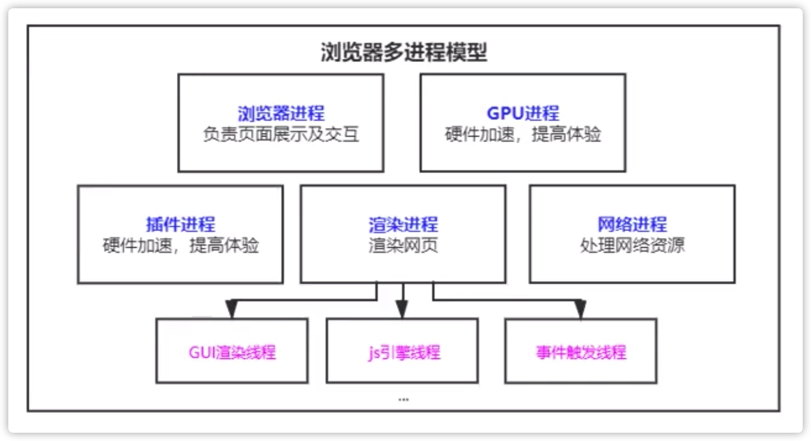
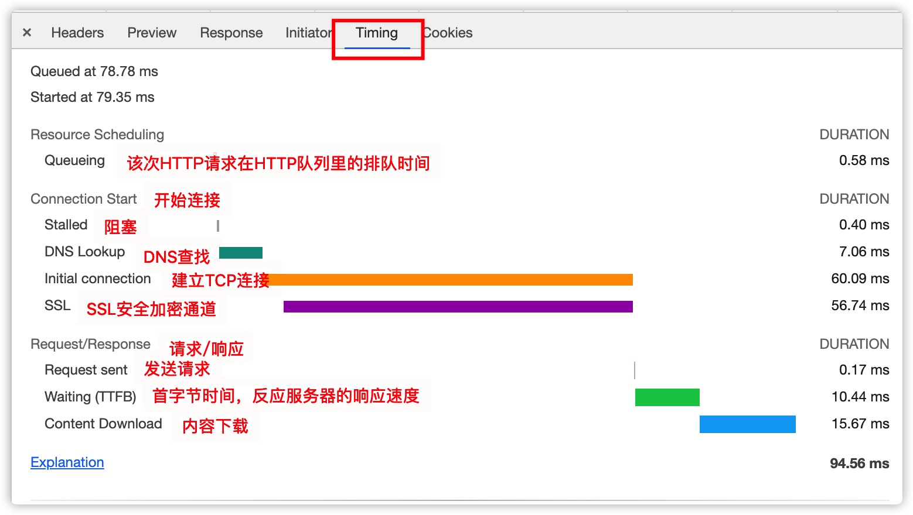
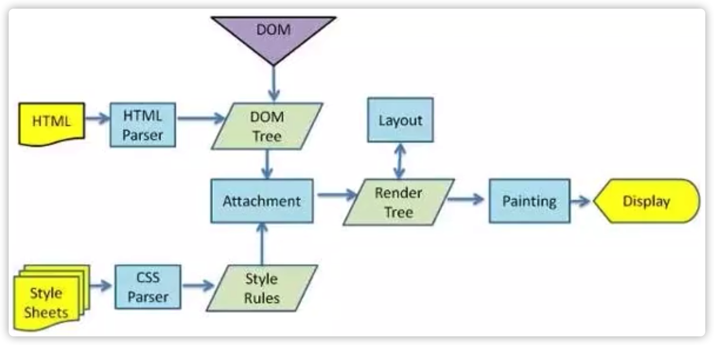
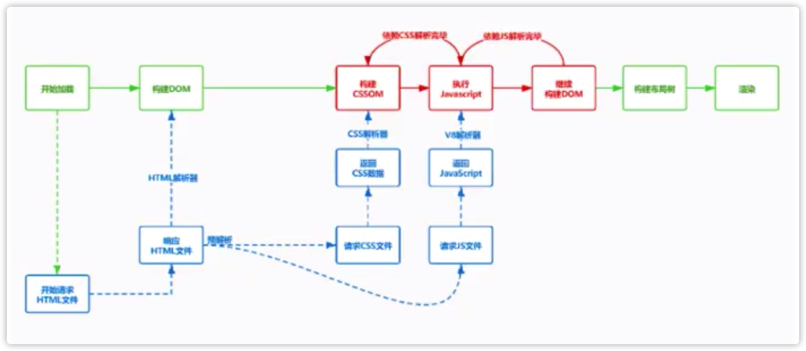

# 浏览器渲染原理

前言：本文的所有内容均可在[How browsers work](http://taligarsiel.com/Projects/howbrowserswork1.htm)里面找到，这是官方关于浏览器是如何工作的一系列详细介绍。

## 一、进程与线程
---

* 进程是操作系统资源分配的最小单位，进程中包含线程。
* 线程是操作系统任务调度的最小单位，线程是有进程所管理的。
* 为了提升浏览器的稳定性和安全性，浏览器采用了多进程模型。

### 1. 浏览器中的5个进程

* 浏览器进程：负责界面显示、用户交互、子进程管理、提供存储等。
* 渲染进程：每个页卡都有单独的渲染进程，核心用于渲染页面。
* 网络进程：主要处理网络资源加载（.html、.css、.js等）。
* GPU进程：3d绘制，提高性能。
* 插件进程：chrome中安装的一些插件。

其中，渲染进程是我们最关心的的进程，它包含了以下3个主要的线程：
* GUI渲染线程。
* js引擎线程。
* 事件触发线程。

## 二、从输入URL到浏览器显示页面发生了什么？
---

### 1. 浏览器进程的相互调用（从浏览器进程的角度分析）

1. 首先，用户在地址栏里输入内容，浏览器会先看用户输入的是关键字还是URL？如果是关键字，则浏览器会根据默认的搜索引擎生成URL地址，然后才开始导航。如果不是关键字，而是URL地址，则直接进行导航。（这一步操作是在浏览器进程里进行的）

2. 浏览器会准备一个渲染进程，用于渲染页面。

3. 通过网络进程加载资源，将加载的资源交给渲染进程来处理。

4. 渲染完毕，并显示页面。

上面的4个过程，包含的几个进程间的通信是通过IPC进行的。包括Node.js，它里面的进程通信也是通过IPC进行的。这个4个过程是从浏览器进程的角度回答的，比较浅，面试的时候大多都是问请求的过程发生了什么，下面将从这方面来回答从输入URL到浏览器显示页面到底发生了什么。

### 2. URL请求过程（从请求的过程的角度分析）

说到请求过程，就要提到网络的七层参考模型`OSI协议层次结构`（物、数、网、传、会、表、应），分别是物理层、数据链路层、网络层、传输层、会话层、表示层和应用层。一般会把会话层、表示层和应用层合并为一层，统称为应用层。HTTP协议就是应用层的协议。TCP位于传输层，HTTP主要是基于TCP协议进程传输的。网络层主要就是我们熟知的IP协议。通常还会把物理层和数据链路层合并为网络访问层，常见的就是双绞线、电缆、光纤等。

> OSI 协议层次结构：  
> 
> 应用层  
> 表示层  
> 会话层  
> 传输层  
> 网络层  
> 数据链路层  
> 物理层  

所以，真实情况下，我们会把七层的OSI参考模型简化为四层的`TCP/IP 协议层次结构`（网、网、传、应），分别是网络访问层、网际层（IP协议）、传输层（TCP协议）和应用层（HTTP协议）。因特网使用的就是该参考模型。

> TCP/IP 协议层次结构：  
> 
> 应用层（HTTP、UDP）  
> 传输层（TCP）  
> 网际层（IP）  
> 网络访问层

现在，我们主要从`TCP/IP 协议层次结构`来分析网络请求的整个过程。

1. 地址栏输入URL地址（域名、网址）。

2. 输入完域名之后，不会直接去请求，而是先去查看当前的这个网址有没有被访问过，这时候就会去查找缓存。如果有缓存，且缓存没有过期的话，就返回缓存的内容，否则就去请求。

3. 接着第2步，如果没有缓存且缓存过期的话，就会通过域名去请求对方的服务器。此时会先看域名是否被解析过，如果没有解析过，就将域名解析成IP地址。此时就需要DNS协议登场，DNS协议会将域名解析成IP地址（域名只是我们方便记忆地址的一个工具，IP地址才真正记录了服务器的地址）。DNS主要做了一个映射表，把我们的域名和IP地址做了一个映射，它只是一个分布式的数据库，那我们就可以使用DNS把域名解析成一个IP地址了。

但是有个需要注意的地方，DNS的域名解析是基于UDP协议的。为什么它是基于UDP，而不是TCP呢？因为我们再解析的过程中，涉及到服务器的查找，我们的服务有一级域名和二级域名，它会迭代去查找，如果使用TCP去传输的话，每经过一个域名服务器，它就需要三次握手和四次挥手，这很浪费时间。UDP就没有三次握手和四次挥手，它是直接发送数据包，然后确认就OK了，速度上极快。TCP（数据分段传输）的好处是安全可靠，UDP（整个数据包一次性传输）是可能会有丢包的情况，我们当然是希望安全可靠最好，但是对于浏览器来说，查个域名，为了速度，肯定会采用UDP，而且如果丢包了，浏览器可以重发，速度很快。

经过DNS协议的域名查找服务之后，我们就可以得到域名对应服务的真正IP地址了，但是我们光有IP地址还不行，还要有服务的端口号Port，IP地址加上端口号Port，才能找到真正的服务。IP地址可以找到服务所在的机器，然后再根据端口号Port就可以在机器上找到真正的服务了。

4. 经过DNS域名服务器查找到真正的IP地址后，就可以使用IP+Port找到服务所在的位置，就可以向服务发送请求了。此时，如果请求采用的是HTTPS协议的话，这时还会有SSL安全加密的过程，保证我们的数据是经过加密后经过加密通道安全传输的。

通过截图内容可以看到，`Connection Start`里的`Initial connection`和`SSL`，这两个大致是在同一时间段内进行的，也就是说，如果发现是HTTPS请求，在建立TCP连接通道的时候，会同步进行SSL协商的建立。

5. 此时，我们使用IP开始寻址，找到服务器后，并不会立马把数据发过去，而是排队等待，因为我们的域名下可能有多个请求，我们同一个域名在HTTP1.1里有限制，就是最多可以建立6个HTTP连接，也就是说，在同一时刻，最多可以发送6个HTTP请求。

6. HTTP请求排完队之后，就开始发送HTTP请求，但是我们的HTTP请求是通过TCP传输的，因此要先让TCP创建连接，此时就会有三次握手，浏览器和服务器的TCP连接通道创建好之后，就可以使用TCP传输HTTP数据包了。这里还有一个延时，就是服务器连接的Stalled过程，这个过程，有可能会发生代理连接、TCP复用等操作，处理完之后，才去发送HTTP数据包了。

7. 但是我们的数据包内容可能很大，不是一口气就能传完的，此时需要拆分成一个个的数据包，按照顺序，将数据包可靠、有序地传输给服务端，服务器收到数据包之后，会将数据包进行重新整合，服务器就获取到客户端传输过阿里的数据了。

HTTP请求的过程中，分为请求行、请求头和请求体。

从HTTP1.1开始，在发送数据的过程中，TCP连接默认是不会断开的（keep-alive），是为了下次传输数据时，可以复用上次创建好的TCP连接通道，省去了建立连接的时间。

8. 服务器收到数据后，解析请求行、请求头和请求体，服务器处理完请求的内容之后，会给浏览器一个响应，有对应的响应行、响应头和响应体。这里面有一个状态码的概念，服务器可以自己去设置状态码。其中比较重要有301和302。

9. 服务器返回301（永久重定向）、302状态码（临时重定向），会进行重定向操作。如果重定向了，那么浏览器和服务器之间又会重新进行DNS域名查找、IP寻址、建立TCP连接（传输HTTP数据包）、解析请求内容、服务端处理逻辑，最后服务器再次给客户端响应新的内容，那么这个过程很耗时，因此，我们再代码里，如果有些链接已经被重定向了，那我们尽量使用重定向后的链接，不要使用旧的链接了，这样会避免一次重定向的发生，减少服务请求和响应的时间，提高性能，提升用户体验。

还有304状态码，如果服务器返回了304，那么浏览器就收到之后，就会查询浏览器缓存（服务端可以设置强制缓存）。

Chrome浏览器开发者工具Network窗口下，Timing中显示资源在整个请求生命周期过程中各部分花费的时间。

各个字段的具体解释，可以查看当前目录下的`./Timing各参数.md`文档。

### 3. HTTP发展历程

#### （1）HTTP0.9 

在传输过程中没有请求头和响应头。服务器响应没有返回头信息，内容采用ASCII字符流来进行传输。

#### （2）HTTP1.0 

实现了请求头和响应头，可根据header的不同来处理不同的资源，实现多类型数据传输。一个服务器在发送完一个 HTTP 响应后，会断开 TCP 链接。但是这样每次请求都会重新建立和断开 TCP 连接，代价过大。

#### （3）HTTP1.1 

默认开启了keep-alive以维持TCP持久连接，可以在一个TCP连接上同步地传输不同的http请求（单个 TCP 连接在同一时刻只能处理一个请求）。

完美支持分块传输（chunk transfer），并引入客户端cookie机制、安全机制等。

Chrome最多允许对同一个 Host 建立六个 TCP 连接。不同的浏览器有一些区别。

但是存在一个问题：单个 TCP 连接在同一时刻只能处理一个请求。意思是说：两个请求的生命周期不能重叠，任意两个 HTTP 请求从开始到结束的时间在同一个 TCP 连接里不能重叠。虽然 HTTP/1.1 规范中规定了 [Pipelining](https://blog.51cto.com/jianshusoft/626670) 来试图解决这个问题，但是这个功能在浏览器中默认是关闭的。

先来看一下 Pipelining 是什么，RFC 2616 中规定了：一个支持持久连接的客户端可以在一个连接中发送多个请求（不需要等待任意请求的响应）。收到请求的服务器必须按照请求收到的顺序发送响应。（至于标准为什么这么设定，我们可以大概推测一个原因：由于 HTTP/1.1 是个文本协议，同时返回的内容也并不能区分对应于哪个发送的请求，所以顺序必须维持一致。比如你向服务器发送了两个请求 GET /query?q=A 和 GET /query?q=B，服务器返回了两个结果，浏览器是没有办法根据响应结果来判断响应对应于哪一个请求的。）

Pipelining 这种设想看起来比较美好，但是在实践中会出现许多[问题](https://my.oschina.net/u/4316091/blog/4808508)，例如Head-of-line Blocking 连接头阻塞（队头阻塞）的问题：在建立起一个 TCP 连接之后，假设客户端在这个连接连续向服务器发送了几个请求。按照标准，服务器应该按照收到请求的顺序返回结果，假设服务器在处理首个请求时花费了大量时间，那么后面所有的请求都需要等着首个请求结束才能响应。（大家的请求都在同一时刻发送出去，那么大家的响应回来的时候也是一起回来的，但是回来的时间会受到在服务器上消耗时间最长的那个请求的时间的限制，只有当消耗时间最长的按个请求也处理完了可以响应了，大家的响应才会一起回来）。

除了队头阻塞问题，还有一些代理服务器不能正确的处理 HTTP Pipelining。由于Pipelining模式的使用是非常有限，只允许GET和HEAD请求，所以现代浏览器默认是不开启 HTTP Pipelining 的，甚至很多语言的HttpClient组件并不支持Pipelining这种方式。

#### （4）HTTP2.0 

解决网络带宽使用率低（TCP慢启动，多个TCP竞争带宽，对头阻塞）采用多路复用机制（一个域名使用一个TCP长连接，通过二进制分帧层来实现）。

头部压缩（HPACK）：HTTP2中的很多header前面，都有一个冒号，那些header都会被压缩。

服务推送：以前都是客户端请求服务器，现在服务器可以推送数据给客户端。

> 提供了 Multiplexing 多路传输特性，可以在一个 TCP 连接中同时完成多个 HTTP 请求。
> 
> 在 HTTP/1.1 存在 Pipelining 技术可以完成这个多个请求同时发送，但是由于浏览器默认关闭，所以可以认为这是不可行的。  
> 在 HTTP2 中由于 Multiplexing 特点的存在，多个 HTTP 请求可以在同一个 TCP 连接中并行进行。

#### （5）HTTP3.0 

因TCP存在各种阻塞问题：（1）丢包重传阻塞：TCP传输过程中，如果发生了丢包现象，那么后面所有的包就发生了阻塞，要等待丢失的那个包重新发送完，再继续发送。（2）队头阻塞。

HTTP3就解决了阻塞的问题，不再基于TCP，而是采用了UDP，并且在UDP的上一层加了一个QUIC协议。因为TCP丢包就会重新发送，UDP传输速度快，但是不可靠，没关系，如果数据丢失了，UDP就再重新发送一遍数据，反正UDP传输很快。

HTTP3.0还存在很多问题，目前还没有大范围使用。

### 4. 渲染流程

1. 浏览器无法直接使用HTML（因为浏览器收到的HTML是文本，也就是字符串，所以无法识别，JS也没法进行DOM操作），需要将HTML转化成DOM树（将HTML从上到下一个字节一个字节地解析成一个个节点，根据解析的结果生成DOM树）。（document）

2. 浏览器无法直接使用纯文本的css的样式，需要对css进行解析（Parse Stylesheet），解析成styleSheets。`CSSOM`（document.styleSheets）。

3. 计算出DOM树中每个节点的具体样式。（Attachment）

4. 创建渲染（布局）树，将DOM树中可见节点添加到布局树中。并计算节点渲染到页面的坐标位置。（Render tree）

5. 通过渲染树，进行分层（根据定位属性、透明属性、transform属性、clip属性等）生产图层树。（Layout）

6. 将不同图层进行绘制（Painting），转交给合成线程（Compositor）处理。最终生产页面，并显示到浏览器上。（Painting,Display）

> 关键字：解析HTML（构建DOM树）、渲染

CSS不会阻塞HTML解析：构建DOM树的时候，并不会等待css加载和解析。

JS会阻塞HTML的解析：。

渲染DOM的时候，分两种情况：
1. 如果<link></link>标签放在上面（<body></body>之前，一般是<head></head>里），那么渲染DOM的时候，会等待css加载并解析完，将解析完的DOM树和解析的样式CSSOM符合（Attachment）在一起，然后再进行渲染。
2. 如果<link></link>标签放在下面（<body></body>之后，或是被当做<body></body>里面的最后一个元素），那么渲染的时候，不会等待css加载，而是先进行已解析到的DOM节点的渲染，等到css加载完整之后，又会进行一遍HTML解析和css解析，然后将新的DOM树和解析的样式CSSOM组合在一起，然后再次进行渲染。这符合重绘的特点，因此代价很大。

因此，渲染DOM的时候，可能会等待CSS，也可能不会等待，就看CSS是放在上面的，还是下面的。但是HTML解析的时候，也就是构建DOM树的时候，并不会等待CSS，这个是明确的。因为HTML的解析和CSS的解析是分开的，互不干扰。

JS会阻塞HTML解析，需要暂停HTML解析去执行javascript。因为js可能会操作样式，所以需要等待css加载并解析完成，再继续解析后面的HTML。
因此JS要放在页面的底部，否则会阻塞后面代码的渲染，导致DOMContentLoaded很慢。

JS机会阻塞HTML解析，也会阻塞渲染，JS要等上面的css加载并解析完成，保证JS可以操作样式。

总结：DOM如何生成的

* 整个页面开始加载的时候，会去请求html文件，服务器返回类型是`text/html`文件，浏览器会将收到的数据通过`HTML Parser`进行解析（边下载边解析）。
* 在解析前会执行预解析操作，会预先加载`js`、`css`等文件。
* 字节流 -> 分词器 -> `Tokens` -> 根据`token`生成节点 -> 插入到`DOM树`中。
* 遇到`js`：在解析过程中遇到`script`标签，`HTML Parser`会停止解析，（下载）执行对应的脚本。
* 在`js`执行前，需要等待当前脚本之上的所有`css`文件加载并解析完毕（`js`是依赖`css`的加载，因此`js`里可能要操作样式）

## 三、模拟请求->渲染流程
--- 
### 1. 基于TCP发送HTTP请求
### 2. 解析响应结果
### 3. 解析HTML
### 4. 解析CSS
### 5. 计算样式
### 6. 布局绘制

渲染流程 浏览器收到内容后如何解析的？

问题1：我们为什么要把css放在顶端，js放在底端呢？
这和渲染过程有关系，当HTML被解析的时候，是从上到下解析的，但是遇到了样式列表（<link></link>）不会马上去加载css，不会去阻塞dom的解析，而且它的渲染呢，是遇到一个元素就渲染，不是说等到整个页面加载完之后才渲染，所以一再强调样式是不会阻塞html解析的，该加载的加载，该解析的解析，解析完之后，我需要用样式和dom元素组成一棵树，这个树叫布局树，

## 四、LightHouse使用
---
## 五、Performance API
---
## 六、网络优化策略
---

## 七、关键渲染路径
---
### 1. 强制同步布局问题
### 2. 布局抖动（layout thrashing）问题
### 3. 减少回流和重绘

## 八、静态文件优化
---
### 1. 图片优化
### 2. HTML优化
### 3. CSS优化
### 4. JS优化
### 5. 图标优化
## 九、优化策略
---
### 1. 浏览器的存储

## 十、参考链接
* [How browsers work](http://taligarsiel.com/Projects/howbrowserswork1.htm)
* [浏览器的渲染原理简介](https://coolshell.cn/articles/9666.html)
* [浏览器的渲染：过程与原理](https://zhuanlan.zhihu.com/p/29418126)
* [浏览器内核、JS 引擎、页面呈现原理及其优化](https://www.zybuluo.com/yangfch3/note/671516)
* [探究 CSS 解析原理](https://jartto.wang/2017/11/13/Exploring-the-principle-of-CSS-parsing/)
* [浏览器的工作原理：新式网络浏览器幕后揭秘](https://www.html5rocks.com/zh/tutorials/internals/howbrowserswork/#Layered_representation)
* [浏览器原理](https://github.com/lhyt/issue/issues/22)
* [理解关键的渲染路径](https://www.w3cplus.com/performance/understanding-the-critical-rendering-path.html)
* [关键渲染路径](https://github.com/berwin/Blog/issues/29)
* [初探CSS对象模型（CSSOM）](https://www.w3cplus.com/javascript/cssom-css-typed-om.html)
