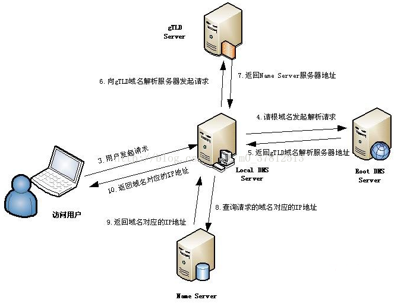

* 因特网上作为域名和IP(Internet Protocol Address)地址相互映射的一个分布式数据库，能够使用户更方便的访问互联网，而不用去记住能够被机器直接读取的IP数串。
* 通过主机名，最终得到该主机名对应的IP地址的过程叫做域名解析（或主机名解析）。
* DNS协议运行在UDP协议之上，使用端口号53。

当一个用户在地址栏输入www.taobao.com时，DNS解析有大致十个过程，如下：

## 一、整个过程大体描述如下
其中前两个步骤是在本机完成的，后8个步骤涉及到真正的域名解析服务器：

1. 浏览器先检查自身缓存中有没有被解析过的这个域名对应的ip地址，如果有，解析结束。同时域名被缓存的时间也可通过TTL属性来设置。

2. 如果浏览器缓存中没有（专业点叫还没命中），浏览器会检查操作系统缓存中有没有对应的已解析过的结果。而操作系统也有一个域名解析的过程。在windows中可通过c盘里一个叫hosts的文件来设置，如果你在这里指定了一个域名对应的ip地址，那浏览器会首先使用这个ip地址。  
 但是这种操作系统级别的域名解析规程也被很多黑客利用，通过修改你的hosts文件里的内容把特定的域名解析到他指定的ip地址上，造成所谓的域名劫持。所以在windows7中将hosts文件设置成了readonly，防止被恶意篡改。

3.  如果至此还没有命中域名，才会真正的请求本地域名服务器（LDNS）来解析这个域名，这台服务器一般在你的城市的某个角落，距离你不会很远，并且这台服务器的性能都很好，一般都会缓存域名解析结果，大约80%的域名解析到这里就完成了。

4. 如果LDNS仍然没有命中，就直接跳到Root Server 域名服务器请求解析

5. 根域名服务器返回给LDNS一个所查询域的主域名服务器（gTLD Server，国际顶尖域名服务器，如.com .cn .org等）地址

6. 此时LDNS再发送请求给上一步返回的gTLD

7. 接受请求的gTLD查找并返回这个域名对应的Name Server的地址，这个Name Server就是网站注册的域名服务器

8. Name Server根据映射关系表找到目标ip，返回给LDNS

9. LDNS缓存这个域名和对应的ip

10. LDNS把解析的结果返回给用户，用户根据TTL值缓存到本地系统缓存中，域名解析过程至此结束

## 二、DNS解析详细的描述过程：

1. 浏览器会检查缓存中有没有这个域名对应的解析过的IP地址，如果缓存中有，这个解析过程就结束。浏览器缓存域名也是有限制的，不仅浏览器缓存大小有限制，而且缓存的时间也有限制，通常情况下为几分钟到几小时不等，域名被缓存的时间限制可以通过TTL属性来设置。这个缓存时间太长和太短都不太好，如果时间太长，一旦域名被解析到的IP有变化，会导致被客户端缓存的域名无法解析到变化后的IP地址，以致该域名不能正常解析，这段时间内有一部分用户无法访问网站。如果设置时间太短，会导致用户每次访问网站都要重新解析一次域名。

2. 如果用户浏览器缓存中没有数据，浏览器会查找操作系统缓存中是否有这个域名对应的DNS解析结果。其实操作系统也有一个域名解析的过程，在Windows中可以通过C:\Windows\System32\drivers\etc\hosts文件来设置，在Linux中可以通过/etc/hosts文件来设置，用户可以将任何域名解析到任何能够访问的IP地址。例如，我们在测试时可以将一个域名解析到一台测试服务器上，这样不用修改任何代码就能测试到单独服务器上的代码的业务逻辑是否正确。正是因为有这种本地DNS解析的规程，所以有黑客就可能通过修改用户的域名来把特定的域名解析到他指定的IP地址上，导致这些域名被劫持。

3. 前两个过程无法解析时，就要用到我们网络配置中的"DNS服务器地址"了。操作系统会把这个域名发送给这个LDNS，也就是本地区的域名服务器。这个DNS通常都提供给用户本地互联网接入的一个DNS解析服务，例如用户是在学校接入互联网，那么用户的DNS服务器肯定在学校；如果用户是在小区接入互联网，那么用户的DNS就是再提供接入互联网的应用提供商，即电信或联通，也就是通常说的SPA，那么这个DNS通常也会在用户所在城市的某个角落，不会很远。Windows环境下通过命令行输入ipconfig，Linux环境下通过cat /etc/resolv.conf就可以查询配置的DNS服务器了。这个专门的域名解析服务器性能都会很好，它们一般都会缓存域名解析结果，当然缓存时间是受到域名的失效时间控制的。大约80%的域名解析到这里就结束了，所以LDNS主要承担了域名的解析工作。

4. 如果LDNS仍然没有命中，就直接到Root Server域名服务器请求解析

5. 根域名服务器返回给本地域名服务器一个所查询的主域名服务器（gTLD Server）地址。gTLD是国际顶级域名服务器，如.com、.cn、.org等，全球只有13台左右

6. 本地域名服务器LDNS再向上一步返回的gTLD服务器发送请求

7. 接受请求的gTLD服务器查找并返回此域名对应的Name Server域名服务器的地址，这个Name Server通常就是用户注册的域名服务器，例如用户在某个域名服务提供商申请的域名，那么这个域名解析任务就由这个域名提供商的服务器来完成

8. Name Server域名服务器会查询存储的域名和IP的映射关系表，在正常情况下都根据域名得到目标IP地址，连同一个TTL值返回给DNS Server域名服务器

9. 返回该域名对应的IP和TTL值，LDNS会缓存这个域名和IP的对应关系，缓存时间由TTL值控制

10. 把解析的结果返回给用户，用户根据TTL值缓存在本地系统缓存中，域名解析过程结束

在实际的DNS解析过程中，可能还不止这10步，如Name Server可能有很多级，或者有一个GTM来负载均衡控制，这都有可能会影响域名解析过程。

## 三、几种域名解析方式

域名解析记录主要分为A记录、MX记录、CNAME记录、NS记录和TXT记录：

1、A记录

A代表Address，用来指定域名对应的IP地址，如将item.taobao.com指定到115.238.23.xxx，将switch.taobao.com指定到121.14.24.xxx。A记录可以将多个域名解析到一个IP地址，但是不能将一个域名解析到多个IP地址

2、MX记录

Mail Exchange，就是可以将某个域名下的邮件服务器指向自己的Mail Server，如taobao.com域名的A记录IP地址是115.238.25.xxx，如果将MX记录设置为115.238.25.xxx，即xxx@taobao.com的邮件路由，DNS会将邮件发送到115.238.25.xxx所在的服务器，而正常通过Web请求的话仍然解析到A记录的IP地址

3、CNAME记录

Canonical Name，即别名解析。所谓别名解析就是可以为一个域名设置一个或者多个别名，如将aaa.com解析到bbb.net、将ccc.com也解析到bbb.net，其中bbb.net分别是aaa.com和ccc.com的别名

4、NS记录

为某个域名指定DNS解析服务器，也就是这个域名由指定的IP地址的DNS服务器取解析

5、TXT记录

为某个主机名或域名设置说明，如可以为ddd.net设置TXT记录为"这是XXX的博客"这样的说明

## 四、清除缓存的域名

我们知道DNS域名解析后会缓存解析结果，其中主要在两个地方缓存：

1. Local DNS Server

2. 用户的本地机器

这两个缓存都是TTL值和本机缓存大小控制的，但是最大缓存时间是TTL值，基本上Local DNS Server的缓存时间就是TTL控制的，很难人工介入，但是我们的本机缓存可以通过如下方式清除：
1. Windows环境下可以再命令行执行ipconfig /flushdns命令来刷新缓存。
2. Linux环境下可以通过/etc/init.d/nscd restart来清除缓存，因为我家里电脑装的虚拟机比较卡，就不截图了

重启依然是解决很多问题的第一选择。

在Java应用中JVM也会缓存DNS的解析结果，这个缓存是在InetAddress类中完成的，而且这个缓存时间还比较特殊，它有两种缓存策略：
1. 正确解析结果缓存
2. 失败解析结果缓存

这两个缓存时间有两个配置项控制，配置项在%JAVA_HOME%\lib\security\java.security文件中配置的，这两个配置项分别是networkaddress.cache.ttl和
networkaddress.cache.negative.ttl，它们的默认值分别是-1（永不失效）和10（缓存10秒），直接修改这两个值就可以了，也可以通过在Java启动参数中增加-Dsun.net.inetaddr.ttl=xxx来修改默认值，也可以通过InetAddress类动态修改。

## 五、8.8.8.8地址
8.8.8.8是一个IP地址，是Google提供的免费DNS服务器的IP地址，Google提供的另外一个免费DNS服务器的IP地址是：8.8.4.4 。用户可以使用Google提供的DNS服务器上网。

### 8.8.8.8产品服务
2009年12月04日Google公司宣布推出免费公共域名解析服务（Public DNS），而这只是其努力控制你在网络上活动的一部分。一般而言，DNS服务都是由你的ISP（互联网服务提供商）提供的，但是Google希望把这项任务交给自己，Google宣称这将让网民上网更加迅速以及安全。

### 8.8.8.8DNS
DNS（Domain Name System）中文意思为域名解析服务器，它在互联网的作用是把域名转换成为网络可以识别的IP地址。
当用户在浏览器中输入网址域名时，首先就会访问系统设置的DNS域名解析服务器（通常由ISP运营商如电信、联通提供）。如果该服务器内保存着该域名对应的IP信息，则直接返回该信息供用户访问网站。否则，就会向上级DNS逐层查找该域名的对应数据。
DNS 命名用于 Internet 等 TCP/IP 网络中，通过用户友好的名称查找计算机和服务。当用户在应用程序中输入 DNS 名称时，DNS 服务可以将此名称解析为与之相关的其他信息，如 IP 地址。因为，你在上网时输入的网址，是通过域名解析系统解析找到了相对应的IP地址，这样才能上网，其实，域名的最终指向是IP。
一般用户在打开一个网页页面之前，就已经经历过了上百次的DNS查询，而一些复杂的页面则需要的解析次数更多，这无疑降低了用户的网络体验。Google公司产品经理Prem Ramaswami这样说道：我们过去几个月的研究发现，DNS解析的速度跟如今的高速互联网体验息息相关，因此我们的工程师一直在努力改善我们的公共DNS服务器，使用户的网上冲浪体验更快，更加安全和可靠。

### 8.8.8.8公共DNS
谷歌提供给大众的公用DNS服务器8.8.8.8，Google的免费DNS服务器的IP地址非常容易记忆：“8.8.8.8”和“8.8.4.4”,使用方法也很简单，具体如下：在“网络连接”中找到宽带上网的连接，打开网络连接属性，双击进入Interner协议（TCP/IP）的属性页，不要选择自动获取DNS，而要选择“使用下面的DNS服务器地址”，首选DNS服务器和备用DNS服务器分别设置为 8.8.8.8和8.8.4.4。

## 六、什么是TTL值?
TTL值全称是“生存时间（Time To Live)”，简单的说它表示DNS记录在DNS服务器上的缓存时间。

要理解TTL值，请先看下面的一个例子：假设，有这样一个域名myhost.abc.com，对应IP地址为1.1.1.1，把它的TTL设为3600秒，这个域名或称这条记录存储在一台名为dns.abc.com的DNS服务器上。

现在有一个用户在浏览器中键入以下地址（又称URL）：http://myhost.abc.com 这时会发生什么呢？

该访问者指定的DNS服务器（或是他的ISP,互联网服务商, 动态分配给他的)8.8.8.8就会试图为他解析myhost.abc.com，当然8.8.8.8这台DNS服务器由于没有包含 myhost.abc.com这条信息，因此无法立即解析，但是通过全球DNS的递归查询后，最终定位到dns.abc.com这台DNS服务器， dns.abc.com这台DNS服务器将myhost.abc.com对应的IP地址1.1.1.1告诉8.8.8.8这台DNS服务器，然后再由 8.8.8.8告诉用户结果。8.8.8.8为了以后加快对myhost.abc.com这条记录的解析，就将刚才的1.1.1.1结果保留一段时间，这段时间就是TTL值，在这段时间内如果用户又有对myhost.abc.com这条记录的解析请求，它就直接告诉用户IP地址为1.1.1.1，当TTL到期则又会重复上面的过程。